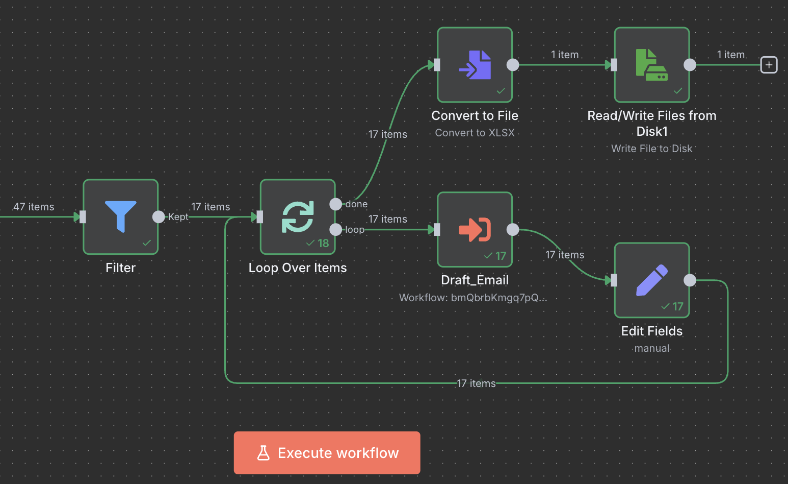
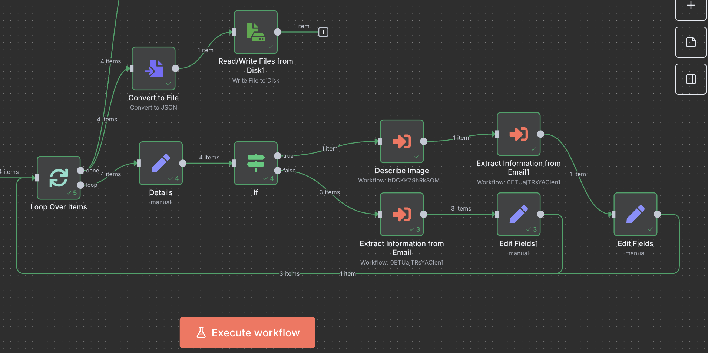

# 3nhance
🚀 3Nhance is an AI-powered offline agent that enhances structured data using replies from users via email — including natural text and attached documents or images.

🧠 Built with **Gemma 3n**, **Ollama**, and **n8n**, the pipeline processes real-world human responses, recognizes and extracts relevant data (via `gemma3n`), and generates **SQL insert/update** queries to fill data gaps. A control bot acts as an evaluator, optionally escalating changes to human managers for approval.

---

## 🔍 Key Features

- 📧 Extracts structured data from user replies to emails
- 🧾 Processes PDFs, DOCs, and images using `gemma3n`
- 🧠 Uses Ollama + Gemma 3n locally (offline) for reasoning
- 🛠️ Docker-based standardization of input documents
- 🧪 500+ successful data operations in 30 days
- ✅ Control bot to review and approve updates to DB

## 📊 Performance Results (Average Time per Email Creation)

### Email Generation

The table below shows the average time taken to generate an email across various hardware setups, comparing two configurations: `Gemma3N e2b` and `Gemma3N e4b`.
This was done with 17 data requests, in difference devices with similar n8n and ollama versions

| Hardware / Config    | e2b (seconds) | e4b (seconds) |
|----------------------|---------------|---------------|
| Mac Mini (M4 Pro)    | 2.91          | 4.51          |
| MacBook Pro (M3 Pro) | 3.23          | 4.92          |
| MacBook Air (M3)     | 2.96          | 4.66          |
| MiniPC (Intel N100)  | 35.4          | N/A           |

> ℹ️ *Note: "N/A" indicates the configuration was not tested on that device.*

### Email Processing (With and Without Attachments)

This table shows the average time taken to generate emails with and without attachments across two MacBook models.

| Hardware             | e2b (s) | e4b (s) | e2b + Attachments (s) | e4b + Attachments (s) |
|----------------------|---------|---------|------------------------|------------------------|
| MacBook Air (M3)     | 2.10    | 3.32    | 6.49                   | 9.67                   |
| MacBook Pro (M3 Pro) | 2.32    | 3.41    | 5.94                   | 8.01                   |

> 📌 **Observation:** While both models perform similarly without attachments, the **MacBook Pro (M3 Pro)** handles attachments significantly faster than the MacBook Air, showcasing its performance advantage under heavier processing.

---

## Current Status

- Sample dataset created (and saved into sqlite and csv)
- Company context (to support the agent work and personalize outcome)
- Workflow to read dataset and generate emails 
- Sample replies created
- Workflow to process the email and export changes
- Workflow to process Images in attachments
- Merge between previous workflows and GMAIL for email send/read
- Capture of the execution time for further data extract (and benchmark)

### Current usages of Gemma3N:
- Python Code to generate fake data (one time)
- Context Creation (one time)
- *Email Generation* based on data gaps (workflow)
- *Email processing* based on user's reply (workflow)
- (partial) usage of Gemma3 to interpret the image (inside the workflow)
- (offline) Gemma3n is reading the image in python locally, but not as part of Ollama (yet) - Sample Code provided
- (online) Demo using Gemma3n through Open Router

---

## 🚧 Challenges

1. **Ollama doesn't currently support Gemma3n image input.**  
   _[Mitigation: Python code available]_  
   Updating the pipeline as-is (with Gemma3), and trying to find a workaround to use Gemma3n as part of the pipeline.

2. ~~**Colab is not supporting the free load of Gemma3N, finding alternatives for the live demo.**~~  
   ✅ **Solved 5 AUG** – _Linking a PHP page with Local Ollama for Demo purpose_
Link: https://tiagoc102.sg-host.com/

--- 

## Context

This is part of Google Gemma 3n Hackathon

@misc{google-gemma-3n-hackathon,
    author = {Glenn Cameron and Omar Sanseviero and Gus Martins and Ian Ballantyne and Kat Black and Mark Sherwood and Milen Ferev and Ronghui Zhu and Nilay Chauhan and Pulkit Bhuwalka and Emily Kosa and Addison Howard},
    title = {Google - The Gemma 3n Impact Challenge},
    year = {2025},
    howpublished = {\url{https://kaggle.com/competitions/google-gemma-3n-hackathon}},
    note = {Kaggle}
}

### Next Steps

Continue providing solutions using N8N and Ollama.
Investigate the quality of the responses based on the model
